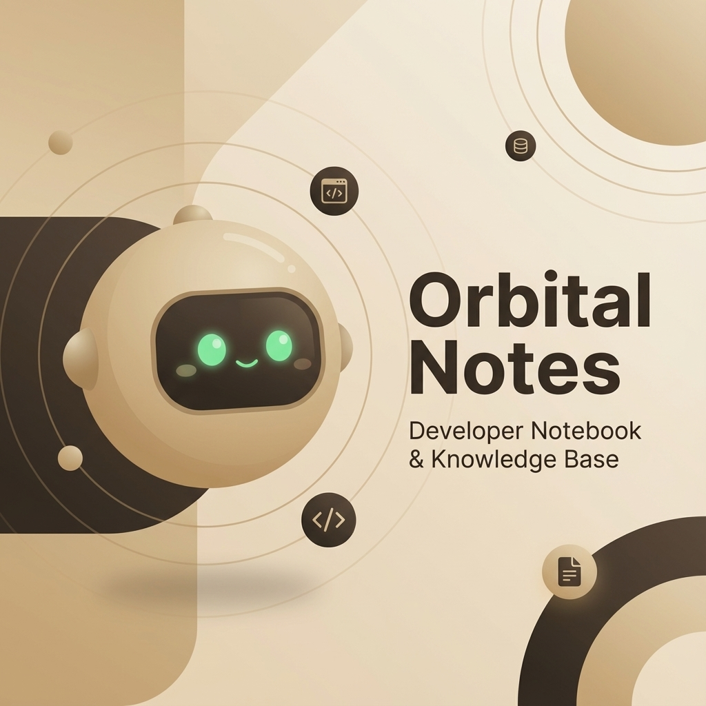
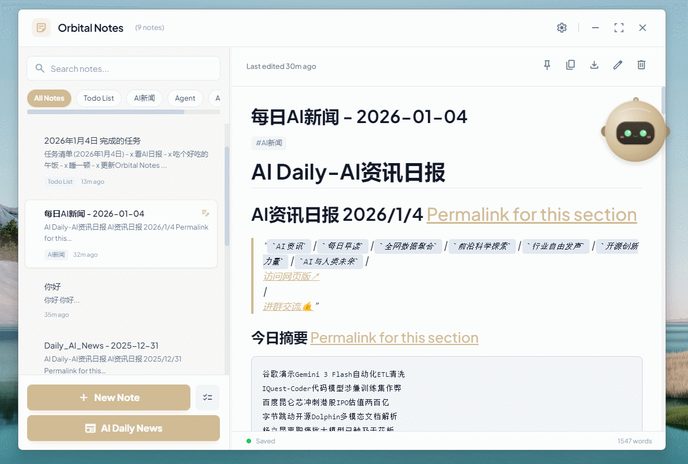
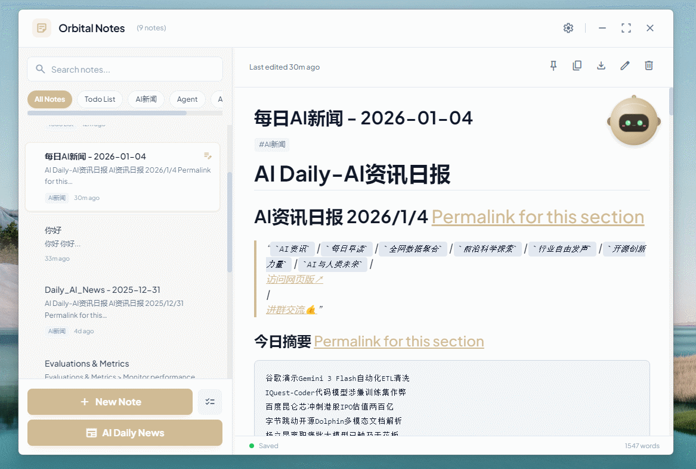
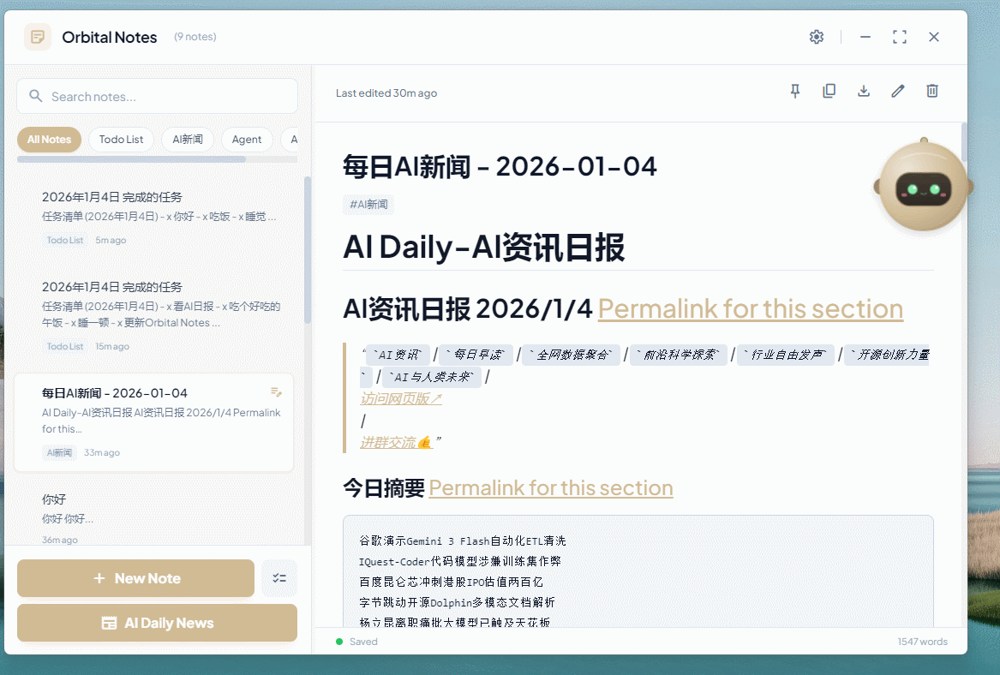
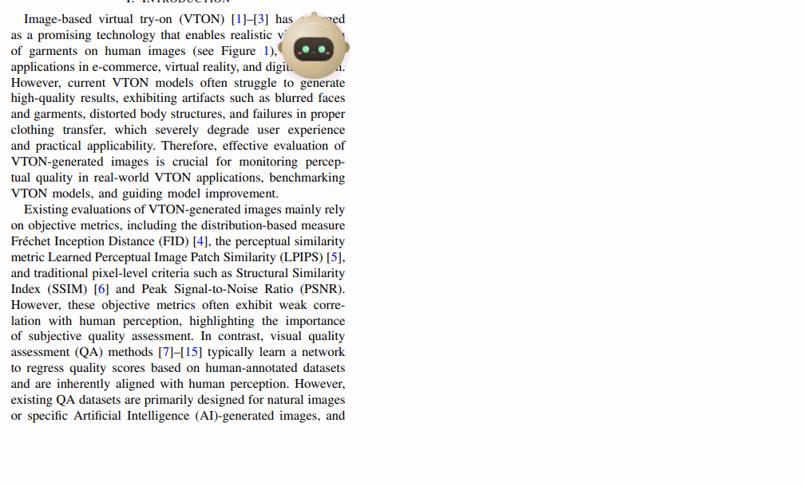

# Orbital Notes 🚀

**Orbital Notes** 是一款专为高效工作者打造的轻量级、悬浮式个人笔记工具。它像卫星一样悬浮在您的桌面边缘，随时捕捉每一闪而过的灵感或关键信息。

---

## ✨ 核心特性

- **🪐 交互式悬浮球**：极简机器人形态，支持自由拖拽与智能悬停交互。鼠标悬停时自动旋转、微笑并展开 **Todo List** 待办面板，让任务管理触手可及。
- **⌨️ 快速唤起**：默认支持 `Alt + 1` 快捷键隐藏/显示悬浮球，让您的桌面保持整洁。
- **📰 AI Daily News**：一键集成 Dify 工作流，自动获取每日 AI 新闻并保存为笔记，支持自动打标。
- **📝 沉浸式编辑**：支持完美渲染的 Markdown 格式（包括表格），并提供 `<Note>`（提示框）和 `<Accordion>`（折叠面板）等高级自定义组件。
- **📥 多格式导出**：支持将笔记导出为 **Markdown、Word (Docx)** 及 **PDF** 格式，完整保留层级结构与核心内容。
- **⚡ 批量操作**：全新的批量管理模式，支持一键多选实现 **批量删除、批量导出**，极大提升整理效率。
- **🎨 极致交互**：放弃原生系统弹窗，采用自研 **Toast 提示组件** 与 **玻璃拟态模态框**，深度适配 `#D0BB95` 主题色。
- **📸 截图、OCR 与翻译**：全能截图工具，支持自由选取区域、**OCR 文字识别**与**多语言智能翻译**，让屏幕信息瞬间沉浸入库。
- **📌 桌面贴图 (Pin)**：支持将截图或剪贴板图片“贴”在桌面最顶层，作为浮动参考，支持自由拖拽与缩放。
- **🌈 主题自定义**：支持**经典棕色**与**樱花粉**双配色切换，配备精美的卡片式视觉预览选择器，满足不同审美需求。
- **🗂️ 笔记管理**：内置强大的笔记管理器，支持标签分类、全文搜索、原地编辑，以及支持鼠标拖拽调整左右比例的响应式布局。
- **⚙️ 深度集成**：支持在设置界面直接配置 Dify Base URL 与 API Key，并可自定义数据路径与窗口初始大小。
- **🚀 开机自启动**：支持在系统设置中开启，确保 Orbital Notes 随系统启动，灵感触手可及。

---

## 📸 界面展示

### 🤖 Orbital 悬浮球与 Todo List

### 🪐 笔记管理器

### 📝 快速记录与预览

### ⚡ 批量导出与管理

### ⚙️ 界面设置与主题切换

### 🏷️ 标签分类与检索

### 📸 截图、OCR 与智能翻译

### 📚 AI Daily News

### 🔗 DIFY CONFIG

---

## 🚀 快速开始

### 📦 启动方式
1. **直接启动（推荐）**：
   下载并运行 `Orbital Notes 1.0.0.exe` 即可一键开启应用。
2. **开发者模式**：
   - 克隆或下载本项目。
   - 在根目录执行依赖安装：`npm install`。
   - 启动应用：`npm start`。

### 🤖 Dify 工作流配置
如果您需要使用 AI Daily News 功能，请导入 `dify_workflow` 目录下的 `Ai_news.yml` 工作流文件到您的 Dify 平台。

## 🛠️ 快捷键指南

- **隐藏/显示悬浮球**：`Alt + 1` (可在设置中自定义)
- **屏幕截图**：`F1` (可在设置中自定义)
- **桌面贴图**：`F3` (从剪贴板或截图创建，可在设置中自定义)
- **左键点击悬浮球**：快速记录
- **右键点击悬浮球**：打开笔记管理器

## 更新日志

### v1.1.5 (2026-01-08)
- **📸 截图、OCR 与智能翻译**：
    - **全能截图**：新增截图功能（默认 `F1`），支持自由拖拽选择区域，内置常用工具栏。
    - **OCR 文字提取**：集成 OCR 识别引擎，一键提取截图中的文字并支持快速复制。
    - **智能翻译**：对接 Qwen 系列强大大模型，支持一键将识别文字精准翻译为中文。
    - **全能导出**：支持将截图、OCR 识别结果或翻译内容一键导出为 **Quick Note**。
- **📌 桌面贴图 (Pin)**：
    - **参考利器**：支持将截图或剪贴板图片固定在桌面最前端，方便对照开发或记录。
    - **极简交互**：贴图支持任意位置拖拽、边缘缩放及悬停快速关闭。
- **⌨️ 快捷键自定义**：
    - **全局定义**：在设置界面新增快捷键管理，支持自定义截图、贴图及主窗口唤起键，彻底解决按键冲突。

### v1.1.4 (2026-01-04)
- **📋 Todo List 导出功能**：
    - **Note 转化**：支持一键将待办列表导出为正式笔记。
    - **智能命名与打标**：导出笔记自动命名为“xxxx年xx月xx日 完成的任务”，并自动添加 `#Todo List` 标签。
    - **自动闭环**：导出完成后自动清空列表，方便开启下一阶段的任务。
- **📏 悬浮球尺寸优化**：
    - **丝滑缩放**：优化了调整悬浮球大小时的渲染逻辑，解决缩小窗口时出现的画面裁剪与闪烁感。
    - **零重叠遮罩**：修复了在小尺寸（如 40px）下内容显示不全的“遮罩”异常，确保全尺寸完美显示。
- **🛠️ 样式微调**：移除了冗余的内边距，提升了小尺寸运行下的视觉容错度。

### v1.1.3 (2026-01-04)
- **🎨 悬浮球配色自定义**：
    - **双主题支持**：新增“樱花粉”主题方案，满足个性化审美。
    - **视觉选择器**：在设置界面引入全新的卡片式主题选择器，支持实时颜色预览。
    - **实时生效**：主题切换无需重启，设置保存后悬浮球色彩立即同步。
- **🐛 细节优化**：修复了设置界面有时无法正确加载当前主题状态的 Bug。

### v1.1.2 (2026-01-04)
- **✨ 悬浮球交互重写**：
    - **智能触发**：悬停 1 秒后触发动画（微笑 + 逆时针旋转 45°），有效避免误触。
    - **滑出待办清单**：悬停自动展开右侧 Todo List 界面，支持实时编辑与勾选，数据自动持久化。
    - **动态边界检测**：优化展开逻辑，确保在屏幕边缘展开时不会超出显示区域，并能精准保持拖拽后的新位置。

### v1.1.1 (2026-01-04)
- **🚀 新增开机自启动**：在设置界面添加开机自启动选项，方便用户随系统自动唤起应用。
- **📦 代码优化**：优化了设置保存逻辑，确保开机自启动设置即时生效。

### v1.1.0 (2025-12-31)
### 🎨 UI & UX 视觉重构
- **全新提示系统**：自研 `Toast` 轻提示组件，替代传统 `alert`，支持成功、错误、信息三种状态。
- **优雅模态框**：重新设计了所有确认对话框，采用 **2rem 超大圆角**、阴影动效及背景虚化，深度匹配主题风格。
- **空间优化**：将笔记管理器默认窗口大小提升至 `1100x750`，提供更舒适的阅读创作体验。
- **Quick Note 增强**：支持通过 **双击标题** 直接重命名，并优化了退出时的未保存提示交互。

### 📥 导出与生产力优化
- **全格式支持**：正式支持 Markdown、Word 及 PDF 导出功能。
- **批量管理**：
    - 新增“批量操作”切换开关。
    - 支持跨页面多选笔记，协同执行批量导出（Markdown/Word/PDF）及物理删除。
- **导出体验提升**：自动清理文件名非法字符，避免导出失败，支持导出文件夹自定义选择。

---

## 🛠️ 技术栈
- **Core**: Electron
- **Export Engine**: docx (Word), puppeteer-core (PDF)
- **Frontend**: HTML5, Vanilla JavaScript, Tailwind CSS
- **Storage**: electron-store (支持自定义数据存储路径)

---

> 由 **AwhiteV** 打造，旨在让记录成为一种享受。
